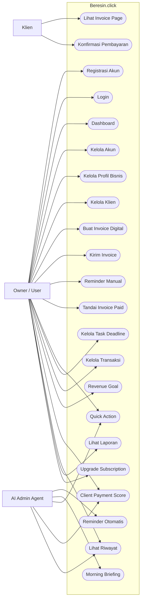
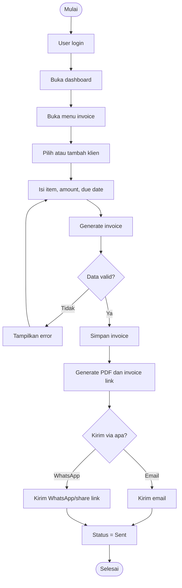
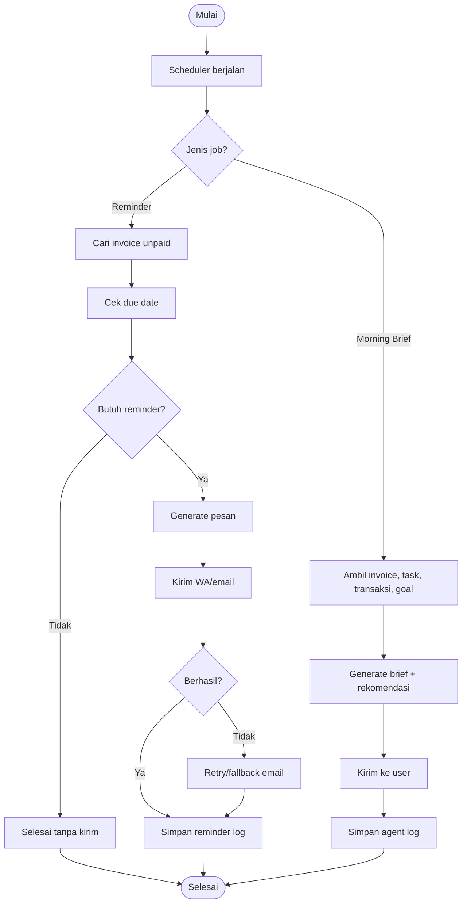
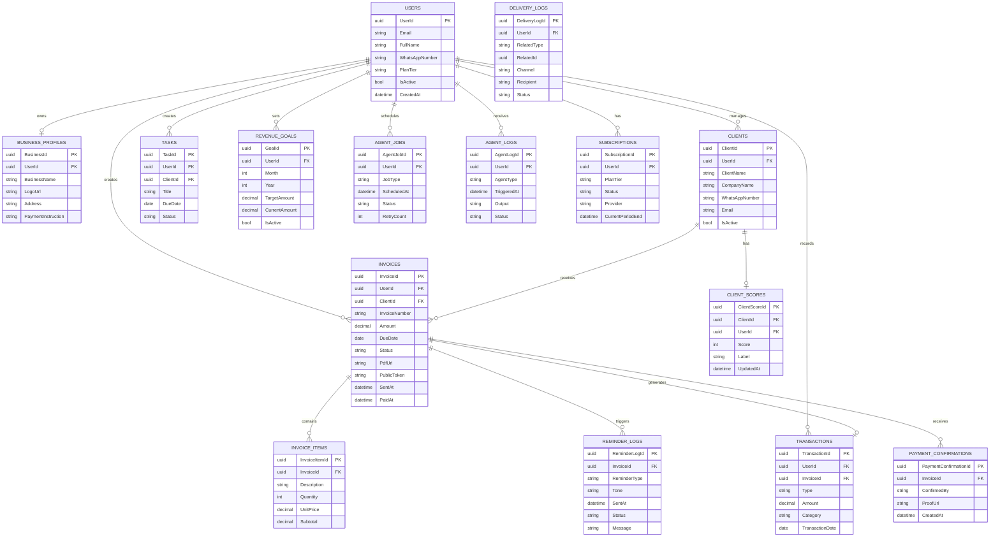
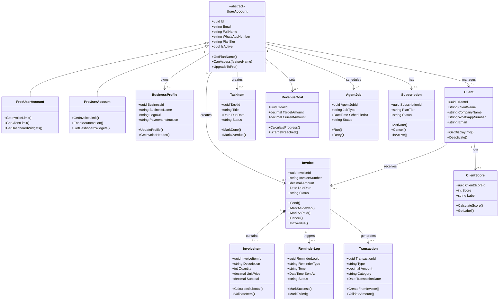
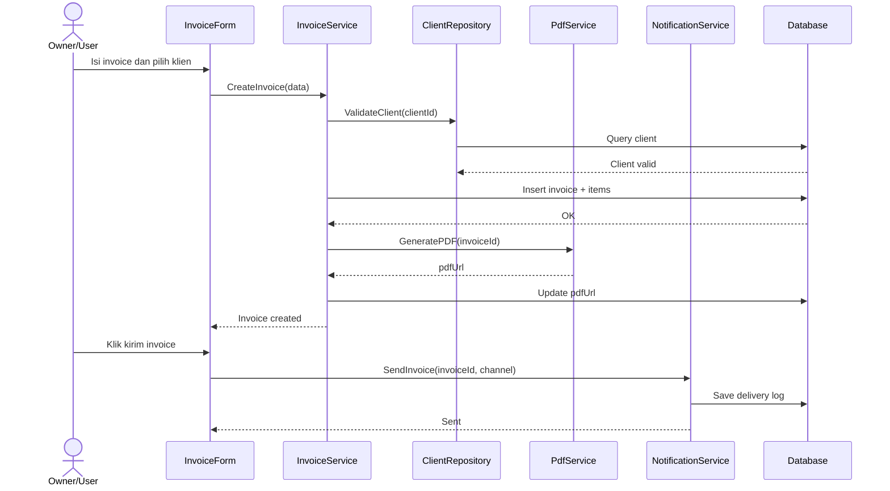
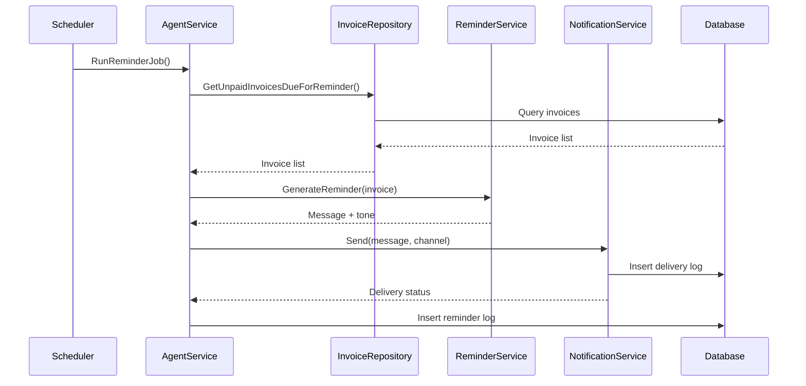
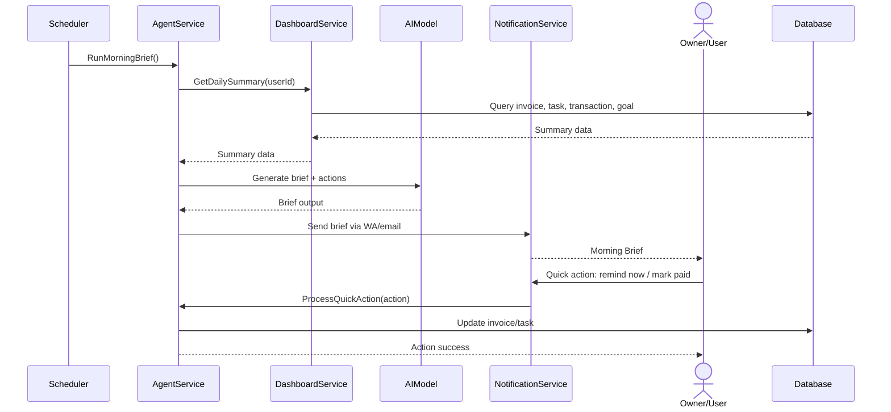
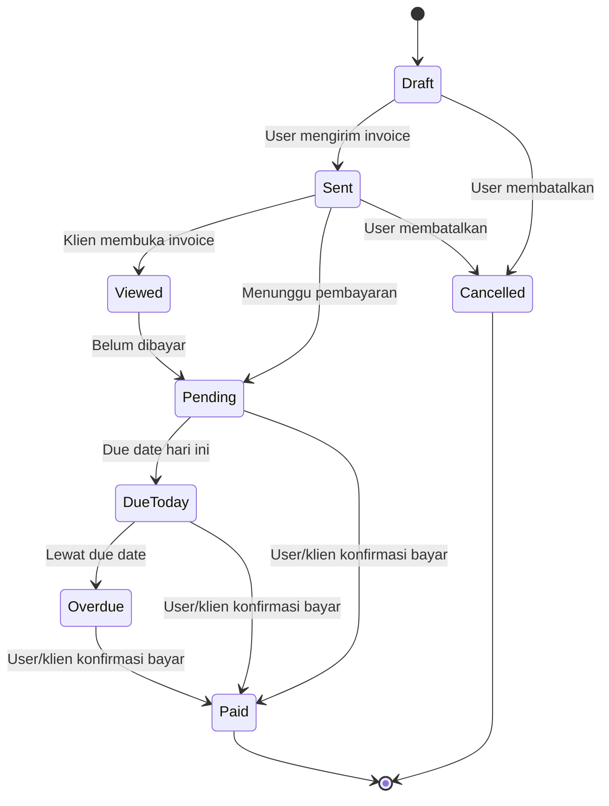
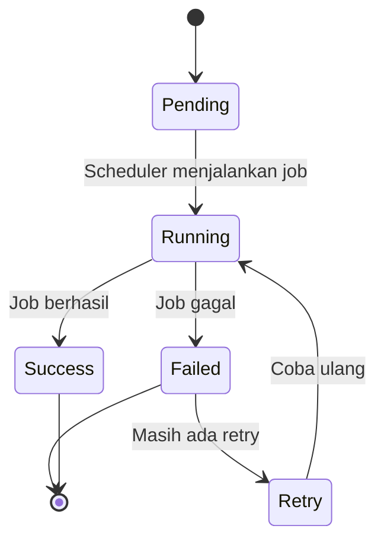

# PRD — AI Admin Autopilot Beresin.click

**Platform:** Web App / SaaS menggunakan Next.js + Supabase
**Database:** Supabase PostgreSQL
**Tema UI:** Hijau mint, hitam/abu gelap, bersih, modern, cepat dibaca
**Role:** Owner/User, AI Admin Agent, Klien

---

# 1. Ringkasan Produk

## 1.1 Nama Produk

**Beresin.click — AI Admin Autopilot buat Freelancer & UMKM Indonesia**

## 1.2 Jenis Produk

Beresin.click adalah aplikasi SaaS berbasis subscription untuk membantu freelancer, solopreneur, dan UMKM kecil mengurus admin bisnis harian secara otomatis. Sistem ini membantu user membuat invoice, mengirim invoice ke klien, mengingatkan pembayaran, melihat deadline, menerima laporan harian, dan mendapatkan rekomendasi tindakan dari AI Admin Agent.

Produk ini bukan sekadar dashboard yang harus sering dibuka. Beresin.click diposisikan sebagai **admin virtual yang aktif mengurus pekerjaan administratif lewat WhatsApp/email**, sehingga user tetap merasa terbantu walaupun tidak sedang membuka aplikasi.

## 1.3 Tujuan Utama

Membangun sistem AI admin yang memungkinkan:

1. User membuat invoice profesional dengan cepat.
2. User mengirim invoice ke klien melalui WhatsApp/email.
3. Sistem mengirim reminder pembayaran otomatis sesuai jadwal.
4. Sistem mengirim Morning Brief setiap pagi berisi invoice pending, deadline, cashflow, dan rekomendasi tindakan.
5. User dapat mengelola klien, invoice, transaksi, dan deadline dalam dashboard sederhana.
6. AI Admin Agent memberi insight harian, mingguan, dan rekomendasi tindakan agar user merasa terbantu terus-menerus.
7. Fitur free tetap berguna untuk mencoba value, tetapi penggunaan yang lebih sering, otomatis, dan nyaman membutuhkan subscription Pro.

---

# 2. Latar Belakang

Banyak freelancer dan UMKM kecil di Indonesia masih mengelola admin bisnis secara manual. Contohnya:

* membuat invoice di Excel/Canva,
* mengirim invoice lewat WhatsApp secara manual,
* lupa follow-up klien yang belum bayar,
* mencatat transaksi di notes atau spreadsheet,
* mengingat deadline proyek dari chat,
* mengecek cashflow tanpa laporan yang rapi,
* membuat laporan mingguan secara manual.

Masalah yang sering terjadi:

* invoice telat ditagih,
* klien telat bayar karena tidak diingatkan,
* cashflow tidak terlihat jelas,
* deadline proyek tercecer di WhatsApp,
* user merasa capek mengurus admin sendirian,
* bisnis terlihat ramai tetapi uang masuk tidak stabil,
* user membuka terlalu banyak tools: WhatsApp, Sheets, Notes, Calendar, email, dan mobile banking.

Karena itu, Beresin.click dibuat untuk memberikan sistem sederhana tetapi bernilai tinggi, dengan alur end-to-end:

**user buat invoice → sistem kirim invoice → AI Agent follow-up otomatis → pembayaran ditandai → sistem kirim laporan dan insight.**

Nilai tambah terbesar Beresin.click adalah membuat user merasa: **“setiap pagi ada yang bantu ngecek bisnis gue.”**

---

# 3. Visi Produk

Menyediakan AI admin autopilot yang:

* mudah digunakan oleh freelancer dan UMKM Indonesia,
* bekerja aktif melalui WhatsApp/email,
* membantu uang masuk lebih cepat lewat invoice reminder,
* membangun kebiasaan harian melalui Morning Brief,
* memberikan rasa kontrol terhadap cashflow dan deadline,
* menyediakan dashboard sederhana, bukan dashboard kompleks,
* memiliki subscription yang terasa worth it karena menghemat waktu dan membantu mempercepat pembayaran,
* realistis untuk MVP 2–4 minggu, tetapi punya jalan menuju produk subscription yang kuat.

---

# 4. Tujuan Produk

## 4.1 Tujuan Operasional

* Memudahkan user membuat invoice profesional.
* Memudahkan user mengirim invoice ke klien.
* Mengotomatisasi reminder pembayaran.
* Mengurangi rasa awkward saat user harus menagih klien manual.
* Memberikan ringkasan bisnis harian melalui Morning Brief.
* Membantu user mengingat deadline proyek.
* Membantu user melihat cashflow sederhana.
* Membantu user tahu klien mana yang sering telat bayar.
* Membantu user tahu tindakan apa yang harus dilakukan hari ini.

## 4.2 Tujuan Bisnis dan Subscription

Menjadi SaaS subscription yang kuat dengan prinsip:

* Free user harus bisa merasakan value inti.
* Pro user harus merasakan hidupnya jauh lebih enak karena automation aktif.
* Upgrade terjadi secara natural saat user butuh invoice lebih banyak, reminder otomatis, channel WhatsApp, recurring invoice, smart insight, dan laporan otomatis.
* Retention dibangun lewat kebiasaan harian, bukan sekadar fitur CRUD.

Fitur yang dirancang agar user kembali terus:

1. **Morning Brief Harian** — laporan otomatis tiap pagi.
2. **Action Button via WhatsApp** — user bisa mark paid, remind again, atau buat invoice cepat.
3. **Revenue Goal & Progress** — user melihat progress target bulanan.
4. **Client Payment Score** — user tahu klien mana yang aman dan mana yang rawan telat bayar.
5. **Weekly Win Report** — user merasa ada progress setiap minggu.
6. **Inbox Zero Admin** — sistem memberi daftar admin task yang harus dibereskan hari ini.

---

# 5. Ruang Lingkup Sistem

## 5.1 Yang Termasuk dalam Sistem

1. Registrasi akun user.
2. Login dan session management.
3. Dashboard berdasarkan role.
4. Manajemen akun dan subscription.
5. Manajemen profil bisnis.
6. Manajemen klien.
7. Invoice generator.
8. Invoice item dan PDF invoice.
9. Pengiriman invoice via WhatsApp/email.
10. Reminder pembayaran otomatis.
11. Status pembayaran invoice.
12. Morning Briefing Agent.
13. Quick Action via WhatsApp/email.
14. Deadline dan task sederhana.
15. Transaksi income/expense sederhana.
16. Revenue goal bulanan.
17. Client Payment Score.
18. Smart Nudge dan upgrade trigger.
19. Riwayat invoice dan reminder.
20. Dashboard output informasi untuk User, AI Agent, dan Klien.
21. Laporan sederhana.

## 5.2 Yang Tidak Termasuk dalam Sistem

1. Akuntansi kompleks.
2. Pajak otomatis penuh.
3. Integrasi bank otomatis pada MVP.
4. Multi-user workspace pada MVP.
5. Project management kompleks seperti Kanban/Gantt.
6. Mobile app native.
7. Multi-currency selain Rupiah pada MVP.
8. E-signature/legal contract.
9. Payroll.
10. Inventory management.
11. CRM enterprise.
12. Marketplace freelancer.
13. AI meeting recap pada MVP.
14. AI proposal generator pada MVP.
15. Integrasi WhatsApp resmi Meta penuh jika belum siap; boleh fallback ke email/Telegram.

---

# 6. Role Pengguna

## 6.1 Owner / User

Owner/User adalah freelancer, solopreneur, atau pemilik UMKM kecil yang menggunakan Beresin.click untuk mengurus admin bisnis.

### Tugas Utama Owner/User

* Registrasi dan login.
* Mengisi profil bisnis.
* Mengelola daftar klien.
* Membuat invoice.
* Mengirim invoice ke klien.
* Mengatur due date.
* Menandai invoice sebagai paid.
* Melihat status invoice.
* Melihat dashboard bisnis.
* Melihat Morning Brief.
* Mengelola deadline dan task sederhana.
* Melihat laporan mingguan.
* Mengatur subscription.

## 6.2 AI Admin Agent

AI Admin Agent adalah sistem otomatis yang bertindak seperti admin virtual untuk membantu user menjalankan tugas rutin.

### Tugas Utama AI Admin Agent

* Mengecek invoice pending setiap hari.
* Mengirim reminder otomatis sesuai jadwal.
* Membuat Morning Brief.
* Menghasilkan rekomendasi tindakan.
* Mendeteksi invoice overdue.
* Memberi alert cashflow sederhana.
* Memberi Client Payment Score.
* Mengirim Weekly Win Report.
* Mencatat aktivitas automation dalam agent logs.

## 6.3 Klien

Klien adalah pihak eksternal yang menerima invoice, reminder, dan payment link dari user.

### Tugas Utama Klien

* Menerima invoice via WhatsApp/email.
* Membuka invoice page.
* Melihat detail invoice.
* Melakukan pembayaran melalui instruksi/payment link.
* Mengirim bukti pembayaran jika diperlukan.
* Menerima reminder pembayaran.
* Mengonfirmasi pembayaran.

---

# 7. Matriks Hak Akses

| Fitur                  |                Owner/User Free |         Owner/User Pro |   AI Admin Agent |  Klien |
| ---------------------- | -----------------------------: | ---------------------: | ---------------: | -----: |
| Registrasi akun        |                             Ya |                     Ya |            Tidak |  Tidak |
| Login                  |                             Ya |                     Ya |            Tidak |  Tidak |
| Dashboard              |                       Terbatas |                     Ya |            Tidak |  Tidak |
| Profil bisnis          |                             Ya |                     Ya |            Tidak |  Tidak |
| Kelola klien           |            Maks. 3 klien aktif |              Unlimited | Lihat data perlu |  Tidak |
| Buat invoice           |                3 invoice/bulan |              Unlimited |            Tidak |  Tidak |
| Generate PDF invoice   |           Ya, template standar |    Ya, custom branding |            Tidak |  Lihat |
| Kirim invoice email    |                             Ya |                     Ya |    Bisa otomatis | Terima |
| Kirim invoice WhatsApp |              Manual/share link |               Otomatis |               Ya | Terima |
| Reminder manual        |                             Ya |                     Ya |            Tidak | Terima |
| Reminder otomatis      |                          Tidak |                     Ya |               Ya | Terima |
| Morning Brief          | Preview 3 hari / versi ringkas |       Full daily brief |               Ya |  Tidak |
| Quick Action WA        |                          Tidak |                     Ya |               Ya |  Tidak |
| Client Payment Score   |                        Preview |                   Full |         Generate |  Tidak |
| Revenue Goal           |                   1 goal aktif | Unlimited goal/history |         Analisis |  Tidak |
| Weekly Report          |                          Tidak |                     Ya |         Generate |  Tidak |
| Recurring Invoice      |                          Tidak |                     Ya |         Generate | Terima |
| Export laporan         |                          Tidak |                     Ya |         Generate |  Tidak |
| Lihat invoice page     |                             Ya |                     Ya |            Tidak |     Ya |
| Konfirmasi pembayaran  |                             Ya |                     Ya |      Baca status |     Ya |
| Kelola subscription    |                             Ya |                     Ya |            Tidak |  Tidak |

---

# 8. Gambaran Umum Alur Sistem

1. User registrasi akun.
2. User login.
3. User mengisi profil bisnis dan nomor WhatsApp.
4. User menambahkan data klien.
5. User membuat invoice.
6. Sistem membuat PDF invoice dan invoice page.
7. User memilih pengiriman melalui WhatsApp/email.
8. Klien menerima invoice.
9. Sistem menyimpan status invoice sebagai **Sent**.
10. AI Admin Agent mengecek due date invoice setiap hari.
11. Jika invoice mendekati jatuh tempo, sistem mengirim reminder H-3.
12. Jika invoice jatuh tempo hari ini, sistem mengirim reminder H-0.
13. Jika invoice overdue, sistem mengirim reminder H+3.
14. Jika invoice overdue terlalu lama, sistem mengirim eskalasi ke user.
15. User atau klien menandai invoice sebagai paid.
16. Sistem membuat transaksi income otomatis.
17. AI Admin Agent mengirim Morning Brief harian.
18. User melihat dashboard, payment score, deadline, dan laporan.
19. Sistem memberi upgrade prompt saat free limit mulai terasa menghambat.

---

# 9. Fitur Utama Sistem

## 9.1 Registrasi dan Login

### Deskripsi

Fitur untuk autentikasi user dan pengalihan ke dashboard sesuai status subscription.

### Subfitur

* Registrasi akun menggunakan email.
* Login menggunakan magic link atau Google OAuth.
* Logout.
* Validasi email unik.
* Validasi akun aktif/nonaktif.
* Pengecekan plan: Free/Pro.
* Pengalihan ke dashboard sesuai plan.
* Onboarding wizard setelah login pertama.

---

## 9.2 Dashboard Berdasarkan Role

Dashboard menjadi output informasi utama sistem. Setiap role melihat informasi yang berbeda sesuai kebutuhan.

---

### 9.2.1 Dashboard Owner/User

#### Tujuan

Memberikan gambaran cepat tentang kondisi admin bisnis hari ini.

#### Informasi yang Ditampilkan

**A. Summary Cards**

1. Outstanding invoice.
2. Revenue bulan ini.
3. Expense bulan ini.
4. Cashflow minggu ini.
5. Invoice overdue.
6. Deadline hari ini.
7. Target revenue progress.
8. Beresin Score.

**B. Tabel Cepat**

1. Invoice terbaru.
2. Klien dengan invoice pending.
3. Task/deadline terdekat.
4. Reminder log terakhir.

**C. Statistik Sederhana**

1. Revenue per minggu.
2. Invoice paid vs overdue.
3. Rata-rata waktu klien bayar.
4. Top 5 klien berdasarkan revenue.

**D. Alert / Notifikasi Internal**

1. Ada invoice overdue.
2. Ada klien yang belum di-follow-up.
3. Ada invoice yang due hari ini.
4. Ada limit Free yang hampir habis.
5. Ada insight dari AI Admin Agent.

#### Output Dashboard Owner/User

| Komponen                | Sumber Data                | Bentuk Tampilan    |
| ----------------------- | -------------------------- | ------------------ |
| Outstanding invoice     | invoices                   | Card angka         |
| Revenue bulan ini       | transactions, invoices     | Card angka         |
| Expense bulan ini       | transactions               | Card angka         |
| Invoice overdue         | invoices                   | Card angka + alert |
| Deadline hari ini       | tasks                      | Card/List          |
| Target revenue progress | goals, transactions        | Progress bar       |
| Beresin Score           | invoices, reminders, tasks | Score card         |
| Invoice terbaru         | invoices, clients          | Table              |
| Reminder log            | reminder_logs              | Timeline           |

---

### 9.2.2 Dashboard AI Admin Agent

#### Tujuan

Membantu sistem memantau pekerjaan otomatis yang harus dijalankan untuk setiap user.

#### Informasi yang Ditampilkan

**A. Summary Cards**

1. Jumlah reminder yang harus dikirim hari ini.
2. Jumlah Morning Brief yang harus dibuat.
3. Jumlah invoice overdue.
4. Jumlah automation gagal.

**B. Tabel Utama**

Daftar job automation hari ini:

* user,
* tipe agent,
* jadwal trigger,
* status,
* channel,
* aksi retry.

**C. Informasi Pendukung**

1. Agent log terakhir.
2. Delivery status WhatsApp/email.
3. Error log.
4. Retry queue.

#### Output Dashboard AI Admin Agent

| Komponen            | Sumber Data         | Bentuk Tampilan |
| ------------------- | ------------------- | --------------- |
| Reminder due today  | reminders, invoices | Card angka      |
| Morning brief queue | agent_jobs          | Card angka      |
| Automation failed   | agent_logs          | Card angka      |
| Job queue           | agent_jobs, users   | Table           |
| Delivery status     | delivery_logs       | Badge status    |
| Retry queue         | delivery_logs       | Action table    |

Catatan: dashboard ini tidak perlu dibuka user umum. Ini bisa menjadi internal admin/debug dashboard.

---

### 9.2.3 Dashboard Klien

#### Tujuan

Memberikan halaman invoice yang jelas, profesional, dan mudah dibayar oleh klien.

#### Informasi yang Ditampilkan

**A. Invoice Card**

1. Nama bisnis user.
2. Nomor invoice.
3. Nama klien.
4. Due date.
5. Total pembayaran.
6. Status invoice.

**B. Detail Invoice**

1. Item pekerjaan.
2. Quantity.
3. Harga satuan.
4. Subtotal.
5. Catatan pembayaran.

**C. Aksi Klien**

1. Download PDF.
2. Lihat instruksi pembayaran.
3. Upload bukti bayar.
4. Konfirmasi sudah bayar.
5. Hubungi user.

#### Output Dashboard Klien

| Komponen            | Sumber Data              | Bentuk Tampilan     |
| ------------------- | ------------------------ | ------------------- |
| Detail invoice      | invoices, invoice_items  | Public invoice page |
| Status invoice      | invoices                 | Badge warna         |
| Payment instruction | business_profiles        | Card                |
| Bukti bayar         | payment_confirmations    | Upload/status       |
| Kontak user         | users, business_profiles | Button WA/email     |

---

## 9.3 Manajemen Akun

Digunakan user untuk mengelola akun pribadi dan subscription.

### Subfitur

* Ubah nama.
* Ubah email.
* Ubah nomor WhatsApp.
* Ubah password jika memakai password login.
* Lihat plan aktif.
* Upgrade ke Pro.
* Batalkan subscription.
* Lihat billing history.
* Hapus akun.

---

## 9.4 Manajemen Profil Bisnis

Digunakan user untuk menyimpan identitas bisnis yang tampil di invoice.

### Data Profil Bisnis

* ID bisnis.
* User akun.
* Nama bisnis.
* Logo bisnis.
* Alamat bisnis.
* Nomor WhatsApp bisnis.
* Email bisnis.
* NPWP opsional.
* Rekening/payment instruction.
* Brand color invoice.

### Subfitur

* Tambah profil bisnis.
* Ubah profil bisnis.
* Upload logo.
* Atur instruksi pembayaran.
* Preview tampilan invoice.
* Custom branding khusus Pro.

---

## 9.5 Manajemen Klien

Digunakan user untuk menyimpan dan mengatur data klien.

### Data Klien

* ID klien.
* User pemilik.
* Nama klien.
* Nama perusahaan.
* Nomor WhatsApp.
* Email.
* Alamat.
* Catatan internal.
* Payment behavior score.
* Status aktif.

### Subfitur

* Tambah klien.
* Ubah klien.
* Nonaktifkan klien.
* Cari klien.
* Lihat detail klien.
* Lihat riwayat invoice klien.
* Lihat rata-rata keterlambatan pembayaran.
* Lihat Client Payment Score.

---

## 9.6 Profil User

Digunakan user untuk melengkapi identitas personal.

### Data User

* ID user.
* Nama lengkap.
* Email.
* Nomor WhatsApp.
* Kota/domilisi.
* Profesi/jenis bisnis.
* Tipe user: freelancer, agency kecil, UMKM.
* Plan tier.

### Subfitur

* Lihat profil.
* Ubah profil.
* Ubah nomor WhatsApp.
* Ubah jenis bisnis.
* Atur preferensi bahasa.
* Atur preferensi tone AI.

---

## 9.7 Invoice Digital

Fitur utama yang memungkinkan user membuat invoice profesional dan mengirimkannya ke klien.

### Subfitur

* Pilih klien.
* Isi item pekerjaan.
* Isi jumlah dan harga.
* Pilih due date.
* Tambahkan catatan pembayaran.
* Generate nomor invoice otomatis.
* Generate PDF invoice.
* Buat public invoice link.
* Kirim invoice via email.
* Share invoice manual via WhatsApp untuk Free.
* Kirim invoice otomatis via WhatsApp untuk Pro.

### Status Invoice

1. Draft.
2. Sent.
3. Viewed.
4. Pending.
5. Due Today.
6. Overdue.
7. Paid.
8. Cancelled.

---

## 9.8 Pengiriman dan Reminder Invoice

Digunakan AI Admin Agent untuk mengirim invoice dan reminder pembayaran.

### Subfitur

* Kirim invoice ke klien.
* Reminder manual.
* Reminder otomatis H-3.
* Reminder otomatis H-0.
* Reminder otomatis H+3.
* Reminder eskalasi H+7 ke user.
* Pilihan tone pesan: sopan, netral, tegas.
* Retry jika pengiriman gagal.
* Fallback email jika WhatsApp gagal.
* Log pengiriman.

### Subscription Gate

* Free: reminder manual dan email basic.
* Pro: reminder otomatis via WhatsApp/email, template tone, retry, dan escalation alert.

---

## 9.9 Task / Deadline Harian

Task adalah data pekerjaan ringan yang membantu Morning Brief terasa berguna setiap hari.

### Subfitur

* Tambah task manual.
* Tambah deadline terkait invoice/proyek.
* Tampilkan deadline hari ini.
* Tampilkan deadline minggu ini.
* Tandai task selesai.
* Reminder task via Morning Brief.
* AI menyarankan task dari invoice overdue.

### Status Task

1. Todo.
2. In Progress.
3. Done.
4. Overdue.

---

## 9.10 Morning Briefing Agent

Digunakan AI Admin Agent untuk mengirim ringkasan harian ke user.

### Subfitur

* Generate brief otomatis jam 07.00 WIB.
* Tampilkan invoice pending.
* Tampilkan invoice overdue.
* Tampilkan deadline hari ini.
* Tampilkan cashflow minggu ini.
* Tampilkan target revenue progress.
* Tampilkan 1–3 rekomendasi tindakan.
* Kirim via WhatsApp/email.
* Quick action: mark paid, remind client, create task, snooze.

### Konten Morning Brief

* “Hari ini ada 2 invoice overdue senilai Rp 4.500.000.”
* “Target revenue bulan ini sudah 68%.”
* “Klien A biasanya bayar 3 hari setelah reminder. Kirim reminder sekarang?”
* “Ada 1 deadline desain jam 16.00.”

### Subscription Gate

* Free: preview Morning Brief selama 3 hari pertama atau versi ringkas di dashboard.
* Pro: Morning Brief harian penuh via WhatsApp/email + quick action.

---

## 9.11 Client Payment Score

Client Payment Score digunakan agar user tahu klien mana yang sehat dan mana yang rawan telat bayar.

### Data Client Payment Score

* ID score.
* Client.
* Total invoice.
* Jumlah invoice paid.
* Jumlah invoice overdue.
* Rata-rata hari pembayaran.
* Rata-rata hari keterlambatan.
* Reminder response rate.
* Score 0–100.
* Label: Aman, Perlu Diingatkan, Rawan Telat.

### Subfitur

* Hitung skor otomatis.
* Tampilkan label klien.
* Tampilkan saran AI.
* Tampilkan riwayat pembayaran.
* Tampilkan rekomendasi tone reminder.

### Contoh Label

|  Score | Label            | Makna                               |
| -----: | ---------------- | ----------------------------------- |
| 80–100 | Aman             | Biasanya bayar tepat waktu          |
|  60–79 | Perlu Diingatkan | Butuh reminder sopan                |
|   0–59 | Rawan Telat      | Sering telat, perlu follow-up tegas |

---

## 9.12 Revenue Goal & Progress

Digunakan user untuk membuat target pendapatan dan merasa progress setiap hari.

### Data Revenue Goal

* ID goal.
* User.
* Bulan.
* Target revenue.
* Revenue terkumpul.
* Progress percentage.
* Status aktif.

### Subfitur

* Buat target bulanan.
* Lihat progress revenue.
* AI memberi insight progress.
* Progress muncul di Morning Brief.
* Alert jika target tertinggal.
* Rayakan milestone 25%, 50%, 75%, 100%.

### Subscription Gate

* Free: 1 target aktif tanpa histori.
* Pro: histori target, insight AI, dan weekly report.

---

## 9.13 Recurring Invoice

Digunakan untuk user yang punya klien retainer atau pembayaran rutin.

### Subfitur

* Buat invoice berulang mingguan/bulanan.
* Atur tanggal generate otomatis.
* Kirim otomatis ke klien.
* Reminder otomatis.
* Pause recurring invoice.
* Duplicate invoice dari invoice sebelumnya.

### Subscription Gate

* Free: duplicate manual.
* Pro: recurring invoice otomatis.

---

## 9.14 Beresin Score / Ringkasan Admin

Beresin Score adalah ringkasan kesehatan admin user yang membantu user merasa ingin “membereskan” dashboard.

### Data Beresin Score

* ID score.
* User.
* Tanggal.
* Invoice overdue count.
* Unfinished task count.
* Unrecorded payment count.
* Missing client data count.
* Revenue progress.
* Score 0–100.

### Catatan Scope

Beresin Score bukan skor finansial resmi. Score ini hanya indikator internal untuk membantu user melihat admin bisnisnya sudah rapi atau belum.

### Contoh Output

* 90–100: Admin Aman.
* 70–89: Cukup Rapi.
* 40–69: Perlu Diberesin.
* 0–39: Banyak yang Ketunda.

---

## 9.15 Riwayat

### Riwayat untuk Owner/User

* Riwayat invoice.
* Riwayat reminder.
* Riwayat pembayaran.
* Riwayat transaksi.
* Riwayat Morning Brief.
* Riwayat Weekly Report.
* Riwayat perubahan status invoice.

### Riwayat untuk AI Admin Agent

* Agent job history.
* Reminder yang berhasil dikirim.
* Reminder yang gagal.
* Morning Brief yang dikirim.
* Error dan retry log.

### Riwayat untuk Klien

* Invoice yang diterima.
* Status pembayaran invoice.
* Bukti bayar yang dikirim.
* Waktu invoice dilihat.

---

## 9.16 Laporan Sederhana

Laporan cukup berupa tabel, filter tanggal, summary angka, dan export PDF/CSV untuk Pro.

### Laporan yang Disarankan

1. Invoice per periode.
2. Invoice paid vs overdue.
3. Revenue per bulan.
4. Expense per bulan.
5. Top client berdasarkan revenue.
6. Klien paling sering telat bayar.
7. Reminder performance.
8. Weekly Win Report.
9. Target revenue progress.
10. Cashflow sederhana.

---

# 10. Use Case Utama

## 10.1 Use Case List

1. Registrasi akun user.
2. Login.
3. Kelola akun.
4. Kelola profil bisnis.
5. Kelola klien.
6. Buat invoice digital.
7. Kirim invoice.
8. Kirim reminder manual.
9. Jalankan reminder otomatis.
10. Tandai invoice paid.
11. Lihat invoice page sebagai klien.
12. Upload bukti pembayaran.
13. Lihat dashboard.
14. Lihat Morning Brief.
15. Jalankan Quick Action.
16. Kelola task/deadline.
17. Kelola transaksi.
18. Kelola revenue goal.
19. Lihat Client Payment Score.
20. Lihat laporan.
21. Upgrade subscription.

---

# 11. Diagram Use Case



---

# 12. Alur Kerja Sistem

## 12.1 Alur Invoice Digital

1. User membuka aplikasi.
2. User login.
3. User membuka dashboard.
4. User memilih menu invoice.
5. User memilih klien.
6. User mengisi item pekerjaan, amount, dan due date.
7. Sistem memvalidasi data.
8. Sistem membuat nomor invoice otomatis.
9. Sistem generate PDF dan public invoice link.
10. User mengirim invoice via email/WhatsApp.
11. Klien menerima invoice.
12. Sistem mengubah status invoice menjadi **Sent**.
13. Jika klien membuka invoice page, status menjadi **Viewed**.

## 12.2 Alur Reminder Otomatis

1. AI Admin Agent berjalan setiap hari jam 09.00 WIB.
2. Sistem mencari invoice yang belum paid.
3. Sistem mengecek due date.
4. Jika H-3, sistem mengirim reminder sopan.
5. Jika H-0, sistem mengirim reminder netral.
6. Jika H+3, sistem mengirim reminder tegas.
7. Jika H+7, sistem mengirim escalation alert ke user.
8. Sistem mencatat reminder log.
9. Jika pengiriman gagal, sistem melakukan retry atau fallback email.

## 12.3 Alur Morning Brief

1. AI Admin Agent berjalan setiap hari jam 07.00 WIB.
2. Sistem mengambil data invoice, task, transaksi, dan goal.
3. Sistem membuat ringkasan personal.
4. Sistem membuat rekomendasi tindakan.
5. Sistem mengirim brief via WhatsApp/email.
6. User menerima brief.
7. User bisa menekan quick action seperti mark paid, remind now, snooze, atau create task.
8. Sistem menyimpan aksi user ke database.

## 12.4 Alur Subscription Upgrade

1. User Free menggunakan fitur dasar.
2. Sistem memantau penggunaan: jumlah invoice, klien aktif, reminder, dan brief.
3. Saat user mencapai limit, sistem menampilkan upgrade prompt.
4. User memilih Pro.
5. User membayar melalui Midtrans.
6. Sistem mengubah plan menjadi Pro.
7. Fitur automation, WhatsApp reminder, recurring invoice, dan report terbuka.

---

# 13. Diagram Aktivitas Invoice Digital



---

# 14. Diagram Aktivitas Reminder dan Morning Brief



---

# 15. Kebutuhan Fungsional

## 15.1 Modul Registrasi

* Sistem harus memungkinkan user membuat akun baru.
* Sistem harus memvalidasi email unik.
* Sistem harus menyimpan akun dengan plan Free secara default.
* Sistem harus membuat profil user setelah registrasi.
* Sistem harus menjalankan onboarding wizard.

## 15.2 Modul Login

* Sistem harus menerima email login.
* Sistem harus mendukung magic link atau OAuth.
* Sistem harus memvalidasi akun aktif.
* Sistem harus mengecek plan user.
* Sistem harus mengarahkan user ke dashboard.

## 15.3 Modul Dashboard

* Sistem harus menampilkan dashboard sesuai role.
* Dashboard user harus menampilkan invoice, revenue, expense, deadline, dan score.
* Dashboard agent harus menampilkan job automation.
* Invoice page klien harus menampilkan detail invoice.
* Data dashboard harus diambil dari database secara dinamis.

## 15.4 Modul Akun

* User dapat mengubah profil akun.
* User dapat mengubah nomor WhatsApp.
* User dapat melihat plan aktif.
* User dapat melihat billing history.
* User dapat upgrade ke Pro.
* User dapat membatalkan subscription.

## 15.5 Modul Profil Bisnis

* User dapat membuat profil bisnis.
* User dapat mengubah nama bisnis.
* User dapat mengunggah logo.
* User dapat mengatur instruksi pembayaran.
* Sistem harus menggunakan profil bisnis pada invoice.

## 15.6 Modul Klien

* User dapat menambah klien.
* User dapat mengubah data klien.
* Sistem harus menyimpan nomor WhatsApp/email klien.
* Sistem harus menampilkan riwayat invoice klien.
* Sistem harus menghitung Client Payment Score.

## 15.7 Modul Invoice

* User dapat membuat invoice.
* Invoice harus terhubung ke user dan klien.
* Invoice harus memiliki minimal satu item.
* Sistem harus generate nomor invoice.
* Sistem harus generate PDF invoice.
* Sistem harus membuat invoice page.
* Sistem harus membatasi jumlah invoice Free.

## 15.8 Modul Pengiriman Invoice

* User dapat mengirim invoice via email.
* User Pro dapat mengirim invoice via WhatsApp otomatis.
* Sistem harus menyimpan delivery status.
* Sistem harus fallback ke email jika WhatsApp gagal.

## 15.9 Modul Reminder

* Sistem harus mengirim reminder otomatis untuk user Pro.
* Reminder harus mengikuti sequence H-3, H-0, H+3, H+7.
* Sistem harus menyimpan reminder log.
* Sistem harus mencegah reminder dobel pada hari yang sama.
* Sistem harus mengirim escalation alert ke user pada H+7.

## 15.10 Modul Morning Briefing

* Sistem harus generate Morning Brief harian.
* Morning Brief harus berisi invoice pending, deadline, cashflow, dan insight.
* Sistem harus mengirim Morning Brief via WhatsApp/email.
* User Pro harus bisa memakai quick action dari brief.
* Sistem harus menyimpan agent log.

## 15.11 Modul Client Payment Score

* Sistem harus menghitung skor berdasarkan histori invoice.
* Sistem harus menampilkan label klien.
* Sistem harus memberi rekomendasi tone reminder.
* Sistem harus membedakan preview Free dan full insight Pro.

## 15.12 Modul Revenue Goal dan Transaksi

* User dapat membuat target revenue bulanan.
* User dapat mencatat income dan expense.
* Invoice paid harus otomatis membuat transaksi income.
* Sistem harus menghitung progress target.
* Sistem harus menampilkan progress di dashboard dan Morning Brief.

## 15.13 Modul Recurring Invoice

* User Pro dapat membuat invoice berulang.
* Sistem harus membuat invoice otomatis sesuai jadwal.
* Sistem harus mengirim invoice otomatis jika opsi aktif.
* User dapat pause recurring invoice.

## 15.14 Modul Riwayat

* User dapat melihat riwayat invoice.
* User dapat melihat riwayat reminder.
* User dapat melihat riwayat pembayaran.
* User dapat melihat riwayat Morning Brief.
* Sistem harus menyimpan perubahan status penting.

## 15.15 Modul Laporan

* User dapat melihat laporan invoice berdasarkan periode.
* User dapat melihat laporan revenue dan expense.
* User dapat melihat laporan klien paling sering telat bayar.
* User Pro dapat export PDF/CSV.
* User Pro menerima Weekly Win Report.

---

# 16. Kebutuhan Non-Fungsional

1. Sistem berjalan sebagai web app responsif.
2. Sistem dibuat menggunakan Next.js, Tailwind, dan Supabase.
3. Database menggunakan PostgreSQL.
4. UI harus sederhana, rapi, dan konsisten.
5. Warna UI menggunakan tone hijau mint, abu gelap, dan putih.
6. Sistem harus menerapkan autentikasi aman.
7. Sistem harus membatasi akses berdasarkan plan subscription.
8. Sistem harus responsif untuk operasi CRUD sederhana.
9. Validasi data wajib dilakukan sebelum data disimpan.
10. Sistem harus mobile-friendly karena user sering memakai HP.
11. Data dashboard harus mudah dibaca dalam 5 detik.
12. Automation harus memiliki retry dan fallback.
13. Sistem harus menjaga data user dengan Row Level Security.
14. Waktu pembuatan invoice pertama harus kurang dari 10 menit setelah sign-up.
15. Morning Brief delivery success rate target minimal 95%.

---

# 17. Aturan Bisnis

1. Setiap user memiliki satu plan aktif: Free atau Pro.
2. User baru otomatis masuk plan Free.
3. Free user hanya dapat membuat 3 invoice per bulan.
4. Free user hanya dapat memiliki 3 klien aktif.
5. Free user tidak mendapat reminder otomatis.
6. Pro user mendapat invoice unlimited.
7. Pro user mendapat reminder otomatis.
8. Pro user mendapat Morning Brief penuh.
9. Invoice wajib memiliki klien, due date, dan minimal satu item.
10. Invoice tidak bisa dikirim jika amount total 0.
11. Invoice yang sudah paid tidak boleh dikirim reminder.
12. Reminder tidak boleh dikirim lebih dari satu kali untuk tipe yang sama pada invoice yang sama.
13. Invoice overdue adalah invoice unpaid setelah due date.
14. Invoice paid otomatis membuat transaksi income.
15. Recurring invoice hanya untuk Pro.
16. Custom branding invoice hanya untuk Pro.
17. Client Payment Score dihitung dari data invoice user sendiri.
18. Klien hanya dapat melihat invoice yang link-nya diberikan.
19. Dashboard menampilkan data sesuai hak akses dan plan user.
20. Upgrade prompt muncul saat limit Free tercapai atau user mencoba fitur Pro.

---

# 18. Validasi Data

* Email tidak boleh kosong.
* Email harus valid dan unik.
* Nama user wajib diisi.
* Nomor WhatsApp harus valid.
* Nama bisnis wajib diisi sebelum invoice pertama dikirim.
* Nama klien wajib diisi.
* Email atau WhatsApp klien minimal salah satu harus diisi.
* Due date invoice wajib diisi.
* Amount invoice harus lebih dari 0.
* Quantity invoice item harus lebih dari 0.
* Harga item tidak boleh negatif.
* Invoice tidak boleh dikirim tanpa item.
* Reminder tidak boleh dikirim untuk invoice paid/cancelled.
* Tanggal recurring invoice harus valid.
* Target revenue harus lebih dari 0.
* Bukti pembayaran harus berupa file yang valid jika upload diaktifkan.

---

# 19. Use Case Specification

## 19.1 Use Case — Registrasi User

| Elemen     | Deskripsi                                                                                                                                                     |
| ---------- | ------------------------------------------------------------------------------------------------------------------------------------------------------------- |
| Nama       | Registrasi User                                                                                                                                               |
| Aktor      | Owner/User                                                                                                                                                    |
| Tujuan     | Membuat akun baru di Beresin.click                                                                                                                            |
| Prasyarat  | User belum memiliki akun                                                                                                                                      |
| Alur Utama | 1. User membuka halaman registrasi. 2. User mengisi email/nama. 3. Sistem memvalidasi data. 4. Sistem membuat akun Free. 5. Sistem mengarahkan ke onboarding. |
| Hasil      | Akun user berhasil dibuat                                                                                                                                     |

## 19.2 Use Case — Buat Invoice Digital

| Elemen     | Deskripsi                                                                                                                                              |
| ---------- | ------------------------------------------------------------------------------------------------------------------------------------------------------ |
| Nama       | Buat Invoice Digital                                                                                                                                   |
| Aktor      | Owner/User                                                                                                                                             |
| Tujuan     | Membuat invoice profesional untuk klien                                                                                                                |
| Prasyarat  | User login dan profil bisnis tersedia                                                                                                                  |
| Alur Utama | 1. User membuka menu invoice. 2. User memilih klien. 3. User mengisi item dan due date. 4. Sistem memvalidasi data. 5. Sistem membuat invoice dan PDF. |
| Hasil      | Invoice tersimpan dengan status Draft atau Sent                                                                                                        |

## 19.3 Use Case — Kirim Reminder Otomatis

| Elemen     | Deskripsi                                                                                                                                                                             |
| ---------- | ------------------------------------------------------------------------------------------------------------------------------------------------------------------------------------- |
| Nama       | Kirim Reminder Otomatis                                                                                                                                                               |
| Aktor      | AI Admin Agent                                                                                                                                                                        |
| Tujuan     | Mengingatkan klien agar membayar invoice tepat waktu                                                                                                                                  |
| Prasyarat  | User Pro, invoice belum paid, dan due date sesuai aturan reminder                                                                                                                     |
| Alur Utama | 1. Scheduler berjalan. 2. Sistem mencari invoice unpaid. 3. Sistem menentukan tipe reminder. 4. Sistem membuat pesan. 5. Sistem mengirim via WhatsApp/email. 6. Sistem menyimpan log. |
| Hasil      | Reminder terkirim atau tercatat gagal/retry                                                                                                                                           |

## 19.4 Use Case — Tandai Invoice Paid

| Elemen     | Deskripsi                                                                                                                                                                              |
| ---------- | -------------------------------------------------------------------------------------------------------------------------------------------------------------------------------------- |
| Nama       | Tandai Invoice Paid                                                                                                                                                                    |
| Aktor      | Owner/User atau Klien                                                                                                                                                                  |
| Tujuan     | Mengubah status invoice menjadi paid                                                                                                                                                   |
| Prasyarat  | Invoice belum paid                                                                                                                                                                     |
| Alur Utama | 1. User/klien membuka invoice. 2. User/klien memilih konfirmasi pembayaran. 3. Sistem memvalidasi status. 4. Sistem mengubah invoice menjadi Paid. 5. Sistem membuat transaksi income. |
| Hasil      | Invoice paid dan cashflow terupdate                                                                                                                                                    |

## 19.5 Use Case — Lihat Morning Brief

| Elemen     | Deskripsi                                                                                                                                                        |
| ---------- | ---------------------------------------------------------------------------------------------------------------------------------------------------------------- |
| Nama       | Lihat Morning Brief                                                                                                                                              |
| Aktor      | Owner/User                                                                                                                                                       |
| Tujuan     | Melihat ringkasan admin bisnis harian                                                                                                                            |
| Prasyarat  | User memiliki data invoice/task/transaksi atau minimal akun aktif                                                                                                |
| Alur Utama | 1. Scheduler berjalan. 2. Sistem mengambil data relevan. 3. AI membuat ringkasan. 4. Sistem mengirim brief. 5. User membaca dan memilih quick action jika perlu. |
| Hasil      | User menerima daftar prioritas hari ini                                                                                                                          |

## 19.6 Use Case — Quick Action dari WhatsApp

| Elemen     | Deskripsi                                                                                                                                        |
| ---------- | ------------------------------------------------------------------------------------------------------------------------------------------------ |
| Nama       | Quick Action dari WhatsApp                                                                                                                       |
| Aktor      | Owner/User Pro                                                                                                                                   |
| Tujuan     | Melakukan aksi admin tanpa membuka dashboard                                                                                                     |
| Prasyarat  | User Pro menerima Morning Brief atau alert                                                                                                       |
| Alur Utama | 1. User menerima pesan. 2. User memilih tombol/keyword. 3. Sistem membaca aksi. 4. Sistem memvalidasi user dan data. 5. Sistem menjalankan aksi. |
| Hasil      | Aksi seperti mark paid/remind/snooze berhasil dilakukan                                                                                          |

## 19.7 Use Case — Lihat Dashboard

| Elemen     | Deskripsi                                                                                                            |
| ---------- | -------------------------------------------------------------------------------------------------------------------- |
| Nama       | Lihat Dashboard                                                                                                      |
| Aktor      | Owner/User, AI Admin Agent, Klien                                                                                    |
| Tujuan     | Melihat informasi penting sesuai role                                                                                |
| Prasyarat  | User berhasil login atau klien memiliki invoice link valid                                                           |
| Alur Utama | 1. Sistem membaca role/akses. 2. Sistem mengambil data relevan. 3. Sistem menampilkan card, tabel, badge, dan alert. |
| Hasil      | Dashboard sesuai role tampil                                                                                         |

---

# 20. Desain Database

## 20.1 Daftar Tabel

Versi revisi menggunakan **15 tabel utama**:

1. `users`
2. `business_profiles`
3. `clients`
4. `invoices`
5. `invoice_items`
6. `reminder_logs`
7. `delivery_logs`
8. `transactions`
9. `tasks`
10. `revenue_goals`
11. `agent_jobs`
12. `agent_logs`
13. `client_scores`
14. `subscriptions`
15. `payment_confirmations`

Catatan: dashboard tidak membutuhkan tabel khusus karena datanya dihitung dari tabel yang sudah ada menggunakan query.

---

## 20.2 Tabel `users`

Menyimpan akun login user.

| Kolom          | Tipe      | Keterangan          |
| -------------- | --------- | ------------------- |
| UserId         | uuid PK   | ID user             |
| Email          | varchar   | Email login         |
| FullName       | varchar   | Nama user           |
| WhatsAppNumber | varchar   | Nomor WhatsApp user |
| PlanTier       | varchar   | Free/Pro            |
| IsActive       | boolean   | Status aktif akun   |
| CreatedAt      | timestamp | Tanggal akun dibuat |

---

## 20.3 Tabel `business_profiles`

Menyimpan identitas bisnis user.

| Kolom              | Tipe             | Keterangan           |
| ------------------ | ---------------- | -------------------- |
| BusinessId         | uuid PK          | ID bisnis            |
| UserId             | uuid FK          | Relasi ke users      |
| BusinessName       | varchar          | Nama bisnis          |
| LogoUrl            | varchar nullable | URL logo             |
| Address            | varchar nullable | Alamat bisnis        |
| BusinessEmail      | varchar nullable | Email bisnis         |
| BusinessWhatsApp   | varchar nullable | WA bisnis            |
| TaxNumber          | varchar nullable | NPWP opsional        |
| PaymentInstruction | text             | Instruksi pembayaran |
| BrandColor         | varchar nullable | Warna invoice        |

---

## 20.4 Tabel `clients`

Menyimpan data klien.

| Kolom          | Tipe             | Keterangan       |
| -------------- | ---------------- | ---------------- |
| ClientId       | uuid PK          | ID klien         |
| UserId         | uuid FK          | Pemilik klien    |
| ClientName     | varchar          | Nama klien       |
| CompanyName    | varchar nullable | Nama perusahaan  |
| WhatsAppNumber | varchar nullable | Nomor WA klien   |
| Email          | varchar nullable | Email klien      |
| Address        | text nullable    | Alamat klien     |
| Notes          | text nullable    | Catatan internal |
| IsActive       | boolean          | Status aktif     |
| CreatedAt      | timestamp        | Tanggal dibuat   |

---

## 20.5 Tabel `invoices`

Menyimpan invoice digital.

| Kolom         | Tipe               | Keterangan                                                |
| ------------- | ------------------ | --------------------------------------------------------- |
| InvoiceId     | uuid PK            | ID invoice                                                |
| UserId        | uuid FK            | Relasi ke users                                           |
| ClientId      | uuid FK            | Relasi ke clients                                         |
| InvoiceNumber | varchar            | Nomor invoice                                             |
| Amount        | decimal            | Total invoice                                             |
| DueDate       | date               | Tanggal jatuh tempo                                       |
| Status        | varchar            | Draft/Sent/Viewed/Pending/DueToday/Overdue/Paid/Cancelled |
| PdfUrl        | varchar nullable   | URL PDF                                                   |
| PublicToken   | varchar            | Token invoice page                                        |
| SentAt        | timestamp nullable | Waktu dikirim                                             |
| PaidAt        | timestamp nullable | Waktu dibayar                                             |
| CreatedAt     | timestamp          | Tanggal dibuat                                            |

---

## 20.6 Tabel `invoice_items`

Menyimpan item pekerjaan dalam invoice.

| Kolom         | Tipe    | Keterangan           |
| ------------- | ------- | -------------------- |
| InvoiceItemId | uuid PK | ID item              |
| InvoiceId     | uuid FK | Relasi ke invoices   |
| Description   | varchar | Deskripsi item       |
| Quantity      | int     | Jumlah               |
| UnitPrice     | decimal | Harga satuan         |
| Subtotal      | decimal | Quantity × UnitPrice |

---

## 20.7 Tabel `reminder_logs`

Menyimpan histori reminder invoice.

| Kolom         | Tipe      | Keterangan                  |
| ------------- | --------- | --------------------------- |
| ReminderLogId | uuid PK   | ID reminder                 |
| InvoiceId     | uuid FK   | Relasi ke invoices          |
| ReminderType  | varchar   | H-3/H-0/H+3/H+7             |
| Tone          | varchar   | Sopan/Netral/Tegas/Eskalasi |
| SentAt        | timestamp | Waktu terkirim              |
| Status        | varchar   | Success/Failed/Retry        |
| Message       | text      | Isi pesan                   |

---

## 20.8 Tabel `delivery_logs`

Menyimpan status pengiriman pesan.

| Kolom         | Tipe          | Keterangan                    |
| ------------- | ------------- | ----------------------------- |
| DeliveryLogId | uuid PK       | ID delivery                   |
| UserId        | uuid FK       | Relasi ke users               |
| RelatedType   | varchar       | invoice/reminder/brief/report |
| RelatedId     | uuid          | ID data terkait               |
| Channel       | varchar       | WhatsApp/Email/Telegram       |
| Recipient     | varchar       | Tujuan pengiriman             |
| Status        | varchar       | Queued/Sent/Failed/Delivered  |
| ErrorMessage  | text nullable | Pesan error                   |
| CreatedAt     | timestamp     | Tanggal dibuat                |

---

## 20.9 Tabel `transactions`

Menyimpan transaksi income/expense sederhana.

| Kolom           | Tipe             | Keterangan                              |
| --------------- | ---------------- | --------------------------------------- |
| TransactionId   | uuid PK          | ID transaksi                            |
| UserId          | uuid FK          | Relasi ke users                         |
| InvoiceId       | uuid FK nullable | Relasi invoice jika income dari invoice |
| Type            | varchar          | income/expense                          |
| Amount          | decimal          | Nominal                                 |
| Category        | varchar          | Kategori                                |
| TransactionDate | date             | Tanggal transaksi                       |
| Notes           | text nullable    | Catatan                                 |

---

## 20.10 Tabel `tasks`

Menyimpan deadline dan task ringan.

| Kolom       | Tipe             | Keterangan                   |
| ----------- | ---------------- | ---------------------------- |
| TaskId      | uuid PK          | ID task                      |
| UserId      | uuid FK          | Relasi ke users              |
| ClientId    | uuid FK nullable | Klien terkait                |
| Title       | varchar          | Judul task                   |
| Description | text nullable    | Deskripsi                    |
| DueDate     | date nullable    | Deadline                     |
| Status      | varchar          | Todo/InProgress/Done/Overdue |
| CreatedAt   | timestamp        | Tanggal dibuat               |

---

## 20.11 Tabel `revenue_goals`

Menyimpan target revenue user.

| Kolom         | Tipe    | Keterangan       |
| ------------- | ------- | ---------------- |
| GoalId        | uuid PK | ID goal          |
| UserId        | uuid FK | Relasi ke users  |
| Month         | int     | Bulan            |
| Year          | int     | Tahun            |
| TargetAmount  | decimal | Target revenue   |
| CurrentAmount | decimal | Revenue saat ini |
| IsActive      | boolean | Status aktif     |

---

## 20.12 Tabel `agent_jobs`

Menyimpan antrian job AI Admin Agent.

| Kolom       | Tipe      | Keterangan                                        |
| ----------- | --------- | ------------------------------------------------- |
| AgentJobId  | uuid PK   | ID job                                            |
| UserId      | uuid FK   | Relasi ke users                                   |
| JobType     | varchar   | reminder/morning_brief/weekly_report/score_update |
| ScheduledAt | timestamp | Jadwal job                                        |
| Status      | varchar   | Pending/Running/Success/Failed                    |
| RetryCount  | int       | Jumlah retry                                      |
| CreatedAt   | timestamp | Tanggal dibuat                                    |

---

## 20.13 Tabel `agent_logs`

Menyimpan output agent.

| Kolom       | Tipe      | Keterangan                                   |
| ----------- | --------- | -------------------------------------------- |
| AgentLogId  | uuid PK   | ID log                                       |
| UserId      | uuid FK   | Relasi ke users                              |
| AgentType   | varchar   | morning_brief/reminder/weekly_report/insight |
| TriggeredAt | timestamp | Waktu agent berjalan                         |
| Output      | text      | Output agent                                 |
| Status      | varchar   | Success/Failed                               |

---

## 20.14 Tabel `client_scores`

Menyimpan skor perilaku pembayaran klien.

| Kolom           | Tipe      | Keterangan                        |
| --------------- | --------- | --------------------------------- |
| ClientScoreId   | uuid PK   | ID score                          |
| ClientId        | uuid FK   | Relasi ke clients                 |
| UserId          | uuid FK   | Relasi ke users                   |
| TotalInvoices   | int       | Total invoice                     |
| PaidInvoices    | int       | Invoice paid                      |
| OverdueInvoices | int       | Invoice overdue                   |
| AvgPaymentDays  | decimal   | Rata-rata hari pembayaran         |
| AvgDelayDays    | decimal   | Rata-rata keterlambatan           |
| Score           | int       | Skor 0–100                        |
| Label           | varchar   | Aman/Perlu Diingatkan/Rawan Telat |
| UpdatedAt       | timestamp | Update terakhir                   |

---

## 20.15 Tabel `subscriptions`

Menyimpan data subscription user.

| Kolom            | Tipe               | Keterangan               |
| ---------------- | ------------------ | ------------------------ |
| SubscriptionId   | uuid PK            | ID subscription          |
| UserId           | uuid FK            | Relasi ke users          |
| PlanTier         | varchar            | Free/Pro                 |
| Status           | varchar            | Active/PastDue/Cancelled |
| Provider         | varchar            | Midtrans                 |
| ProviderRef      | varchar nullable   | ID payment provider      |
| StartedAt        | timestamp          | Mulai subscription       |
| CurrentPeriodEnd | timestamp nullable | Akhir periode aktif      |

---

## 20.16 Tabel `payment_confirmations`

Menyimpan konfirmasi pembayaran dari klien/user.

| Kolom                 | Tipe             | Keterangan         |
| --------------------- | ---------------- | ------------------ |
| PaymentConfirmationId | uuid PK          | ID konfirmasi      |
| InvoiceId             | uuid FK          | Relasi ke invoices |
| ConfirmedBy           | varchar          | user/client        |
| ProofUrl              | varchar nullable | Bukti bayar        |
| Notes                 | text nullable    | Catatan            |
| CreatedAt             | timestamp        | Tanggal konfirmasi |

---

# 21. ERD



---

# 22. OOP Design

## 22.1 Encapsulation

Encapsulation digunakan untuk membatasi perubahan data secara langsung.

Contoh:

* `InvoiceStatus` tidak boleh diubah sembarangan tanpa method valid.
* `PlanTier` hanya boleh berubah melalui subscription/payment service.
* `Amount` invoice tidak boleh negatif.
* `ReminderLog` tidak boleh dibuat dobel untuk tipe yang sama.
* `ClientScore` hanya dihitung oleh service, bukan diinput manual.

## 22.2 Inheritance

Inheritance digunakan untuk menghindari duplikasi atribut.

### User Account

* `UserAccount` sebagai abstract class.
* `FreeUserAccount : UserAccount`.
* `ProUserAccount : UserAccount`.

### Notification Channel

* `NotificationChannel` sebagai abstract class.
* `WhatsAppChannel : NotificationChannel`.
* `EmailChannel : NotificationChannel`.
* `TelegramChannel : NotificationChannel`.

## 22.3 Polymorphism

Polymorphism digunakan saat method yang sama menghasilkan output berbeda.

Contoh:

* `CanAccess(featureName)` berbeda untuk Free dan Pro.
* `Send(message)` berbeda untuk WhatsApp, Email, dan Telegram.
* `GenerateBrief()` bisa menghasilkan versi Free Preview atau Pro Full.
* `GetDashboardWidgets()` berbeda berdasarkan plan user.

## 22.4 Abstraction

Abstraction digunakan melalui abstract class dan interface service/repository.

Contoh interface:

* `IRepository<T>`
* `ICrudService<T>`
* `IAuthService`
* `IInvoiceService`
* `IReminderService`
* `IAgentService`
* `INotificationService`
* `ISubscriptionService`
* `IDashboardService`
* `IReportService`

## 22.5 Association

Association tampak pada:

* user memiliki banyak klien,
* user membuat banyak invoice,
* klien menerima banyak invoice,
* invoice memiliki banyak item,
* invoice memicu banyak reminder,
* user menerima banyak agent log,
* user memiliki subscription aktif.

## 22.6 Composition

Composition tampak pada:

* `Invoice` memiliki kumpulan `InvoiceItem`.
* Tanpa `Invoice`, `InvoiceItem` tidak bermakna.
* `MorningBrief` memiliki kumpulan `BriefSection`.
* Tanpa `MorningBrief`, `BriefSection` tidak bermakna.

---

# 23. Daftar Class Utama

## 23.1 UserAccount

Atribut:

* Id
* Email
* FullName
* WhatsAppNumber
* PlanTier
* IsActive

Method:

* `GetPlanName()`
* `CanAccess(string featureName)`
* `UpgradeToPro()`

## 23.2 FreeUserAccount

Method:

* `GetInvoiceLimit()`
* `GetClientLimit()`
* `GetDashboardWidgets()`

## 23.3 ProUserAccount

Method:

* `GetInvoiceLimit()`
* `EnableAutomation()`
* `GetDashboardWidgets()`

## 23.4 BusinessProfile

Atribut:

* BusinessId
* User
* BusinessName
* LogoUrl
* Address
* PaymentInstruction

Method:

* `UpdateProfile()`
* `GetInvoiceHeader()`

## 23.5 Client

Atribut:

* ClientId
* User
* ClientName
* CompanyName
* WhatsAppNumber
* Email
* IsActive

Method:

* `GetDisplayInfo()`
* `Deactivate()`

## 23.6 Invoice

Atribut:

* InvoiceId
* User
* Client
* InvoiceNumber
* Amount
* DueDate
* Status
* List<InvoiceItem>

Method:

* `Send()`
* `MarkAsViewed()`
* `MarkAsPaid()`
* `Cancel()`
* `IsOverdue()`

## 23.7 InvoiceItem

Atribut:

* InvoiceItemId
* Invoice
* Description
* Quantity
* UnitPrice
* Subtotal

Method:

* `CalculateSubtotal()`
* `ValidateItem()`

## 23.8 ReminderLog

Atribut:

* ReminderLogId
* Invoice
* ReminderType
* Tone
* SentAt
* Status
* Message

Method:

* `MarkSuccess()`
* `MarkFailed()`

## 23.9 Transaction

Atribut:

* TransactionId
* User
* Invoice
* Type
* Amount
* Category
* TransactionDate

Method:

* `CreateFromInvoice()`
* `ValidateAmount()`

## 23.10 TaskItem

Atribut:

* TaskId
* User
* Client
* Title
* DueDate
* Status

Method:

* `MarkDone()`
* `MarkOverdue()`

## 23.11 RevenueGoal

Atribut:

* GoalId
* User
* Month
* Year
* TargetAmount
* CurrentAmount

Method:

* `CalculateProgress()`
* `IsTargetReached()`

## 23.12 ClientScore

Atribut:

* ClientScoreId
* Client
* TotalInvoices
* PaidInvoices
* OverdueInvoices
* AvgPaymentDays
* Score
* Label

Method:

* `CalculateScore()`
* `GetLabel()`

## 23.13 AgentJob

Atribut:

* AgentJobId
* User
* JobType
* ScheduledAt
* Status
* RetryCount

Method:

* `Run()`
* `Retry()`
* `MarkFailed()`

## 23.14 AgentLog

Atribut:

* AgentLogId
* User
* AgentType
* TriggeredAt
* Output
* Status

Method:

* `SaveOutput()`

## 23.15 Subscription

Atribut:

* SubscriptionId
* User
* PlanTier
* Status
* Provider
* CurrentPeriodEnd

Method:

* `Activate()`
* `Cancel()`
* `IsActive()`

---

# 24. Diagram Class



---

# 25. Diagram Sequence

## 25.1 Sequence — Invoice Digital



## 25.2 Sequence — Reminder Otomatis



## 25.3 Sequence — Morning Brief dan Quick Action



---

# 26. Diagram Status

## 26.1 Status Invoice



## 26.2 Status Agent Job



---

# 27. Struktur Arsitektur Proyek

```text
beresin-click/
├── app/
│   ├── (auth)/
│   │   ├── login/page.tsx
│   │   └── register/page.tsx
│   ├── dashboard/page.tsx
│   ├── clients/page.tsx
│   ├── invoices/page.tsx
│   ├── invoices/[id]/page.tsx
│   ├── tasks/page.tsx
│   ├── transactions/page.tsx
│   ├── goals/page.tsx
│   ├── reports/page.tsx
│   ├── billing/page.tsx
│   └── invoice/[token]/page.tsx
├── components/
│   ├── layout/
│   ├── dashboard/
│   ├── invoice/
│   ├── client/
│   ├── billing/
│   └── ui/
├── lib/
│   ├── supabase.ts
│   ├── auth.ts
│   ├── validations.ts
│   ├── permissions.ts
│   ├── formatCurrency.ts
│   └── constants.ts
├── services/
│   ├── AuthService.ts
│   ├── UserService.ts
│   ├── BusinessProfileService.ts
│   ├── ClientService.ts
│   ├── InvoiceService.ts
│   ├── PdfService.ts
│   ├── ReminderService.ts
│   ├── AgentService.ts
│   ├── NotificationService.ts
│   ├── TransactionService.ts
│   ├── GoalService.ts
│   ├── ClientScoreService.ts
│   ├── SubscriptionService.ts
│   ├── DashboardService.ts
│   └── ReportService.ts
├── repositories/
│   ├── UserRepository.ts
│   ├── BusinessProfileRepository.ts
│   ├── ClientRepository.ts
│   ├── InvoiceRepository.ts
│   ├── ReminderRepository.ts
│   ├── DeliveryRepository.ts
│   ├── TransactionRepository.ts
│   ├── TaskRepository.ts
│   ├── GoalRepository.ts
│   ├── AgentRepository.ts
│   ├── ClientScoreRepository.ts
│   └── SubscriptionRepository.ts
├── supabase/
│   ├── migrations/
│   ├── functions/
│   │   ├── send-invoice/
│   │   ├── run-reminders/
│   │   ├── morning-brief/
│   │   ├── weekly-report/
│   │   └── midtrans-webhook/
│   └── seed.sql
├── emails/
│   ├── InvoiceEmail.tsx
│   ├── ReminderEmail.tsx
│   └── MorningBriefEmail.tsx
└── package.json
```

---

# 28. Desain Tampilan UI

## 28.1 Konsep UI

Tampilan sistem menggunakan konsep:

* bersih,
* modern,
* cepat dibaca,
* mobile-first,
* tidak terlalu ramai,
* fokus pada angka uang dan aksi hari ini,
* terasa seperti “admin yang lagi bantu”, bukan software akuntansi berat.

## 28.2 Palet Warna

| Elemen        | Warna     |
| ------------- | --------- |
| Primary       | `#16A34A` |
| Secondary     | `#064E3B` |
| Accent        | `#D1FAE5` |
| Background    | `#F8FAFC` |
| Card / Panel  | `#FFFFFF` |
| Text utama    | `#111827` |
| Text sekunder | `#6B7280` |
| Warning       | `#F59E0B` |
| Danger        | `#EF4444` |
| Success       | `#22C55E` |

## 28.3 Komponen UI yang Disarankan

* Sidebar menu.
* Header halaman.
* Card angka/statistik.
* Badge status warna.
* Table invoice.
* Search box.
* Filter tanggal.
* Button primary dan secondary.
* Progress bar target revenue.
* Timeline reminder.
* Alert card.
* Quick action button.
* Empty state dengan CTA.
* Upgrade prompt yang kontekstual.

## 28.4 Warna Status

| Status    | Warna Tampilan |
| --------- | -------------- |
| Draft     | Abu-abu        |
| Sent      | Biru           |
| Viewed    | Ungu           |
| Pending   | Kuning         |
| Due Today | Oranye         |
| Overdue   | Merah          |
| Paid      | Hijau          |
| Cancelled | Abu-abu gelap  |

---

# 29. Rekomendasi Layout Dashboard

## 29.1 Layout Dashboard Owner/User

```text
+----------------------------------------------------------------+
| Beresin.click | Dashboard                         [Nama User] |
+------------------+---------------------------------------------+
| Sidebar          | Card: Outstanding | Card: Revenue MTD       |
| - Dashboard      | Card: Expense MTD | Card: Beresin Score    |
| - Invoice        |---------------------------------------------|
| - Klien          | Morning Brief Hari Ini                      |
| - Task           | 1. Invoice overdue                          |
| - Transaksi      | 2. Deadline hari ini                        |
| - Goal           | 3. Rekomendasi AI                           |
| - Laporan        |---------------------------------------------|
| - Billing        | Tabel Invoice Terbaru                       |
|                  |---------------------------------------------|
|                  | Client Payment Score                        |
+------------------+---------------------------------------------+
```

## 29.2 Layout Dashboard AI Admin Agent

```text
+----------------------------------------------------------------+
| Beresin.click | Agent Monitor                    [Internal]  |
+------------------+---------------------------------------------+
| Sidebar          | Card: Reminder Due Today                    |
| - Jobs           | Card: Morning Brief Queue                   |
| - Logs           | Card: Failed Delivery                       |
| - Delivery       |---------------------------------------------|
|                  | Table Agent Job                             |
|                  | User | Job Type | Schedule | Status | Retry  |
|                  |---------------------------------------------|
|                  | Delivery Error Log                          |
+------------------+---------------------------------------------+
```

## 29.3 Layout Dashboard Klien / Invoice Page

```text
+-----------------------------------------------------------+
| Beresin.click | Invoice dari [Nama Bisnis]                |
+-----------------------------------------------------------+
| Invoice Card                                               |
| No Invoice | Due Date | Status | Total                    |
|-----------------------------------------------------------|
| Detail Item                                                |
| Deskripsi | Qty | Harga | Subtotal                        |
|-----------------------------------------------------------|
| Instruksi Pembayaran                                       |
| Bank / QRIS / Payment Link                                 |
|-----------------------------------------------------------|
| [Download PDF] [Konfirmasi Sudah Bayar] [Hubungi User]    |
+-----------------------------------------------------------+
```

---

# 30. Query Data Dashboard yang Disarankan

## 30.1 Dashboard Owner/User

* Outstanding invoice: sum dari `invoices` dengan status bukan Paid/Cancelled.
* Revenue MTD: sum `transactions` type income bulan berjalan.
* Expenses MTD: sum `transactions` type expense bulan berjalan.
* Invoice overdue: count `invoices` dengan `DueDate < today` dan status belum Paid.
* Deadline hari ini: data dari `tasks` dengan due date hari ini.
* Beresin Score: dihitung dari overdue invoice, unfinished tasks, dan missing data.
* Target revenue progress: `revenue_goals` dibanding revenue bulan berjalan.
* Client score: data dari `client_scores`.

## 30.2 Dashboard AI Admin Agent

* Reminder due today: query `invoices` unpaid dengan due date sesuai sequence.
* Morning brief queue: query `agent_jobs` dengan job type morning_brief dan status pending.
* Failed delivery: query `delivery_logs` status failed.
* Retry queue: query `agent_jobs` status failed dengan retry count di bawah limit.
* Agent output: query `agent_logs` terbaru.

## 30.3 Dashboard Klien

* Detail invoice: `invoices` join `invoice_items` berdasarkan public token.
* Profil bisnis: `business_profiles` berdasarkan user pemilik invoice.
* Status invoice: `invoices.status`.
* Payment confirmation: `payment_confirmations` berdasarkan invoice id.
* Kontak user: `users` dan `business_profiles`.

---

# 31. Pembagian Tugas untuk 4 Orang

## Anggota 1 — Auth, Session, Akun, Dashboard

Fokus:

* Login/register.
* Session management.
* Role/plan-based access.
* Dashboard user.
* Billing page dasar.

Class/service utama:

* `UserAccount`
* `FreeUserAccount`
* `ProUserAccount`
* `AuthService`
* `DashboardService`
* `SubscriptionService`

## Anggota 2 — Klien, Profil Bisnis, Invoice

Fokus:

* CRUD profil bisnis.
* CRUD klien.
* CRUD invoice.
* Invoice items.
* Public invoice page.

Class/service utama:

* `BusinessProfile`
* `Client`
* `Invoice`
* `InvoiceItem`
* `BusinessProfileService`
* `ClientService`
* `InvoiceService`

## Anggota 3 — PDF, Pengiriman, Reminder, Delivery Log

Fokus:

* Generate PDF.
* Email invoice.
* WhatsApp/Fonnte integration.
* Reminder sequence.
* Delivery retry/fallback.

Class/service utama:

* `PdfService`
* `NotificationService`
* `ReminderService`
* `ReminderLog`
* `DeliveryLog`

## Anggota 4 — Agent, Transaksi, Goal, Laporan

Fokus:

* Morning Briefing Agent.
* Quick action.
* Transaksi income/expense.
* Revenue goal.
* Client Payment Score.
* Weekly report.

Class/service utama:

* `AgentJob`
* `AgentLog`
* `Transaction`
* `RevenueGoal`
* `ClientScore`
* `AgentService`
* `ReportService`

---

# 32. Skenario Demo Presentasi

## Skenario 1 — User Free

1. User registrasi akun.
2. User login.
3. User mengisi profil bisnis.
4. User menambah klien.
5. User membuat invoice pertama.
6. User mengirim invoice via email/share link.
7. User melihat dashboard invoice.

## Skenario 2 — Klien

1. Klien menerima invoice link.
2. Klien membuka invoice page.
3. Klien melihat detail invoice.
4. Klien download PDF.
5. Klien klik konfirmasi sudah bayar.
6. Sistem menyimpan payment confirmation.

## Skenario 3 — User Pro

1. User upgrade ke Pro.
2. User membuat invoice baru.
3. Sistem mengirim invoice via WhatsApp.
4. Reminder otomatis berjalan.
5. User menerima Morning Brief.
6. User klik quick action “Remind Now”.
7. Sistem mengirim reminder dan menyimpan log.

## Skenario 4 — Hasil Akhir

1. User membuka dashboard kembali.
2. User melihat invoice paid.
3. Revenue MTD bertambah.
4. Beresin Score naik.
5. Client Payment Score terupdate.
6. User melihat Weekly Win Report.

---

# 33. Risiko dan Solusi

## 33.1 Risiko

* Modul terlalu banyak jika semua fitur addictive dibangun sekaligus.
* WhatsApp API tidak stabil atau kena limit.
* User Free merasa cukup dan tidak upgrade.
* Reminder dianggap spam oleh klien.
* AI output terlalu panjang atau tidak relevan.
* Cost AI membengkak.
* Role/plan access keliru.
* Status invoice dan reminder bisa dobel.
* Dashboard terlalu ramai.
* User bingung karena fitur terlalu banyak.

## 33.2 Solusi

* Kunci MVP hanya pada invoice, reminder, Morning Brief, dashboard, dan subscription gate.
* Gunakan fallback email jika WhatsApp gagal.
* Batasi Free dengan limit yang terasa natural: 3 invoice, 3 klien, tanpa automation.
* Beri kontrol tone reminder agar tidak terlalu agresif.
* Buat template AI yang singkat dan actionable.
* Cache Morning Brief 24 jam.
* Buat middleware plan checking.
* Buat enum/status yang konsisten.
* Pisahkan service layer dari UI.
* Buat dashboard berdasarkan data yang benar-benar dibutuhkan.
* Prioritaskan fitur inti sebelum gamification tambahan.

---

# 34. Rekomendasi Implementasi Bertahap

Urutan implementasi yang disarankan:

1. Buat database dan semua tabel relasi MVP.
2. Buat model/type sesuai tabel.
3. Setup Supabase Auth dan RLS.
4. Buat login dan session.
5. Buat plan-based access helper.
6. Buat onboarding profil bisnis.
7. Buat CRUD klien.
8. Buat CRUD invoice.
9. Buat invoice items.
10. Buat public invoice page.
11. Buat PDF invoice.
12. Buat kirim email invoice.
13. Buat dashboard dasar.
14. Buat transaksi income otomatis saat invoice paid.
15. Buat reminder manual.
16. Buat cron reminder otomatis untuk Pro.
17. Buat delivery logs.
18. Buat fallback email jika WA gagal.
19. Buat Morning Brief sederhana.
20. Buat quick action dasar: mark paid, remind now, snooze.
21. Buat Midtrans subscription.
22. Buat upgrade prompt.
23. Buat Client Payment Score sederhana.
24. Buat Revenue Goal.
25. Buat Weekly Win Report.
26. Rapikan UI.
27. Rapikan landing page.
28. Soft launch ke 50 beta users.
29. Pantau conversion Free → Pro.
30. Iterasi fitur yang paling sering dipakai.

---

# 35. Kesimpulan

Beresin.click versi revisi ini dibuat agar lebih kuat sebagai SaaS subscription karena:

* memiliki positioning jelas sebagai AI admin autopilot,
* fokus pada problem yang terasa langsung: invoice, reminder, deadline, cashflow,
* fitur gratis tetap berguna untuk mencoba value,
* fitur Pro membuka pengalaman yang jauh lebih enak: automation, WhatsApp reminder, Morning Brief penuh, quick action, recurring invoice, Client Payment Score, dan Weekly Report,
* user punya alasan membuka/menunggu produk setiap hari melalui Morning Brief,
* user punya alasan upgrade karena automation menghemat waktu dan membantu uang masuk lebih cepat,
* database tetap terstruktur dan realistis,
* alur sistem bisa didemokan secara end-to-end,
* fitur “ketagihan” dibangun secara sehat lewat daily value, progress, dan rasa kontrol — bukan sekadar gimmick.

Nilai tambah terbesar pada revisi ini adalah adanya sistem yang aktif bekerja untuk user:

* AI Agent mengingatkan invoice.
* AI Agent memberi laporan pagi.
* AI Agent memberi saran tindakan.
* Dashboard menunjukkan progress uang dan admin.
* Subscription Pro terasa seperti “punya admin pribadi” dengan biaya rendah.

Dengan alur ini, Beresin.click tidak cuma menjadi invoice generator, tetapi menjadi **AI admin yang bikin freelancer dan UMKM merasa bisnisnya lebih rapi setiap hari.**
